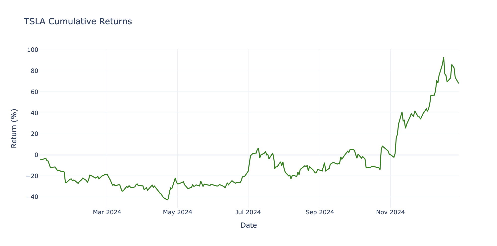

# 1. Introduction

`agentools` is a lightweight and flexible library designed for building smart agent assistants across various industries. Whether you're creating an AI-powered customer service bot, a data analysis assistant, or a domain-specific automation agent, agentools provides a simple yet powerful foundation.

With its modular tool system, you can easily extend your agent's capabilities by integrating a wide range of tools. Each tool is self-contained, well-documented, and can be registered dynamically—making it effortless to scale and adapt your agent to new tasks or environments.


To install and use this library please following:

```
git@github.com:datascienceworld-kan/agentools.git
cd agentools
pip install -r requirements.txt
poetry install
```

To use a list of default tools inside [agentools.tools](agentools/tools/) you should set environment varibles inside `.env` including `TOGETHER_API_KEY` to use llm models at [togetherai](https://api.together.ai/signin) site and `TAVILY_API_KEY` to use tavily websearch tool at [tavily](https://app.tavily.com/home) site:

```
TOGETHER_API_KEY="Your together API key"
TAVILY_API_KEY="Your Tavily API key"
```
Let's create your acounts first and then create your relevant key for each website.

# 2. Set up Agent

`agentools` is a flexible library for creating intelligent agents. You can configure your agent with tools, each encapsulated in a Python module under `agentools.tools`. This provides a workspace of tools that agents can use to interact with and operate in the realistic world. Each tool is a Python file with full documentation and it can be independently ran. For example, the [agentools.tools.websearch_tools](agentools/tools/websearch_tools.py) module contains code for interacting with a search API.


```python
from langchain_together import ChatTogether 
from agentools.agent.agent import Agent
from dotenv import load_dotenv
load_dotenv()

llm = ChatTogether(
    model="meta-llama/Llama-3.3-70B-Instruct-Turbo-Free"
)

# Step 1: Create Agent with tools
agent = Agent(
    description="You are a Financial Analyst",
    llm = llm,
    skills = [
        "Deeply analyzing financial markets", 
        "Searching information about stock price",
        "Visualization about stock price"],
    tools = ['agentools.tools.websearch_tools',
             'agentools.tools.yfinance_tools']
)

# Step 2: invoke the agent
message = agent.invoke("Who you are?")
```

If the answer is a normal message without using any tools, it will be an `AIMessage`. By contrast, it will have `ToolMessage` type. For examples:

```
message
```
```
AIMessage(content='I am a Financial Analyst.', additional_kwargs={'refusal': None}, response_metadata={'token_usage': {'completion_tokens': 7, 'prompt_tokens': 308, 'total_tokens': 315, 'completion_tokens_details': None, 'prompt_tokens_details': None, 'cached_tokens': 0}, 'model_name': 'meta-llama/Llama-3.3-70B-Instruct-Turbo-Free', 'system_fingerprint': None, 'finish_reason': 'stop', 'logprobs': None}, id='run-070f7431-7176-42a8-ab47-ed83657c9463-0', usage_metadata={'input_tokens': 308, 'output_tokens': 7, 'total_tokens': 315, 'input_token_details': {}, 'output_token_details': {}})
```
Access to `content` property to get the string content.

```
message.content
```
```
I am a Financial Analyst.
```

The following function need to use yfinancial tool, therefore the return value will be `ToolMessage` with the a stored pandas.DataFrame in `artifact` property.

```
df = agent.invoke("What is the price of Tesla stock in 2024?")
df
```
```
ToolMessage(content="Completed executing tool fetch_stock_data({'symbol': 'TSLA', 'start_date': '2024-01-01', 'end_date': '2024-12-31', 'interval': '1d'})", tool_call_id='tool_cde0b895-260a-468f-ac01-7efdde19ccb7', artifact=pandas.DataFrame)
```

To access `pandas.DataFrame` value:

```
df.artifact.head()
```


Another example, if you visualize a stock price using a tool, the output message is a `ToolMessage` with the saved `artifact` is a plotly plot.

```
# return a ToolMessage which we can access to plot by plot.artifact and content by plot.content.
plot = agent.invoke("Let's visualize Tesla stock in 2024?")
```

    

```
# return a ToolMessage which we can access to plot by plot.artifact and content by plot.content.
plot = agent.invoke("Let's visualize the return of Tesla stock in 2024?")
```
  

    

# 3. Register function tool

Function tools are registered directly in your runtime code by decorating them with the @function_tool without saving them into python module files.


```python
from agentools.register.tool import function_tool
from typing import List

@function_tool
def sum_of_series(x: List[float]):
    return f"Sum of list is {sum(x)}"
```
```
INFO:root:Registered tool: sum_of_series (runtime)
```

```python
message = agent.invoke("Sum of this list: [1, 2, 3, 4, 5, 6, 7, 8, 9, 10]?")
message
```
```
ToolMessage(content="Completed executing tool sum_of_series({'x': [1, 2, 3, 4, 5, 6, 7, 8, 9, 10]})", tool_call_id='tool_56f40902-33dc-45c6-83a7-27a96589d528', artifact='Sum of list is 55')
```

# 4. Deep Search

With agentools, you can invent a complex workflow by combining multiple tools into a single agent. This allows you to create a more sophisticated and flexible agent that can adapt to different task. Let's see how an agent can be created to help with financial analysis by using `deepsearch` tool, which allows you to search for information in a structured manner. This tool is particularly useful for tasks that require a deep understanding of the data and the ability to navigate through complex information.

```
from langchain_together import ChatTogether 
from agentools.agent.agent import Agent
from dotenv import load_dotenv
load_dotenv()

llm = ChatTogether(
    model="meta-llama/Llama-3.3-70B-Instruct-Turbo-Free"
)

agent = Agent(
    description="You are a Financial Analyst",
    llm = llm,
    skills = [
        "Deeply analyzing financial markets", 
        "Searching information about stock price",
        "Visualization about stock price"],
    tools = ['agentools.tools.deepsearch']
)
    
message = agent.invoke("Let's analyze Tesla stock in 2025?")
print(message.artifact)
```

[](https://youtu.be/MUOg7MYGUzE)

The output is available at [agentools/examples/deepsearch.md](agentools/examples/deepsearch.md)

# 5. License
`agentools` is released under the MIT License. You are free to use, modify, and distribute the code for both commercial and non-commercial purposes.

# 6. Contributing
We welcome contributions from the community. If you would like to contribute, please read our [Contributing Guide](https://github.com/datascienceworld-kan/agentools/blob/main/CONTRIBUTING.md). If you have any questions or need help, feel free to join [Discord Channel](https://discord.com/channels/1036147288994758717/1358017320970358864).
